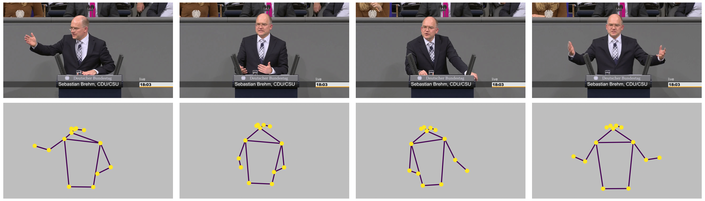
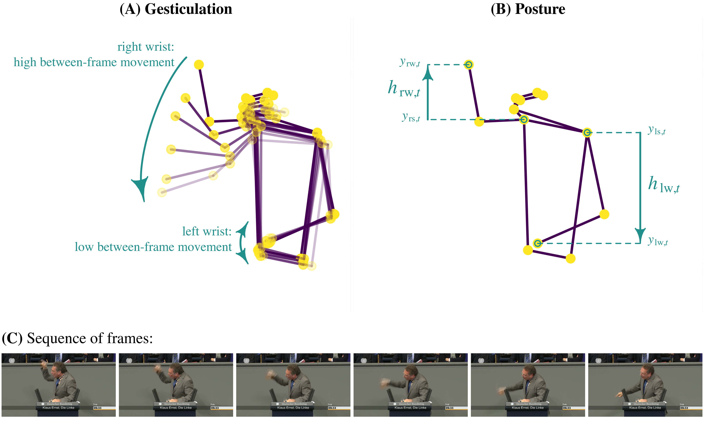

---
# Title
title: "Computationally Analyzing Politicians’ Body Language Using Pose Estimation"

# Add additional authors in a hyphenated list
author:
- Oliver Rittmann

# Date of publication (to be adjusted by editorial team)
date: 2020-01-30T01:00:00+01:00

# Categories (to be adjusted by editorial team)
categories: 
  - tutorials
  
# Tags (to be adjusted by editorial team)
tags: 
  - R

# bib-file (optional)
# bibliography: 
---

<!-- 
Please specify all required packages in the pkgs vector
Note: Please assign a name (such as "packages") to each code chunk 
-->
```{r packages, echo=FALSE, results='hide', message=FALSE, include=FALSE, eval=TRUE}
## Save package names as a vector of strings
pkgs <- c("here", 
          "dplyr",
          "stringr",
          "jsonlite",
          "viridis",
          "scales",
          "imager")

## Install uninstalled packages
lapply(pkgs[!(pkgs %in% installed.packages())], install.packages)

## Load all packages to library and adjust options
lapply(pkgs, library, character.only = TRUE)
```

<!-- 
One introductory paragraph for the blog post: 
Topic, presenter, workshop, relevance 
-->
Politicians can increase the appeal of their speeches through nonverbal cues such as gestures and vocal emphasis. Understanding the factors that make political speech appealing is central to political science research, yet studying nonverbal cues during political speech is difficult due to their audiovisual nature. Pose estimation models---a class of computer vision models that locate and trace human body key points, such as hands, ellbows, and shoulders throughout videos---offer a valuable opportunity to computationally assess politicians' body language in video recordings. In this [Methods Bites Tutorial](https://www.mzes.uni-mannheim.de/socialsciencedatalab/categories/tutorials/), [Oliver Rittmann](https://oliver-rittmann.com) offers a hands-on recap of his workshop "Computationally Analyzing Politicians' Body Language Using Pose Estimation" in the [MZES Social Science Data Lab](https://www.mzes.uni-mannheim.de/socialsciencedatalab/page/events/) in the Fall Term 2024, in which he introduces pose estimation models and explains their implementation for analysing the body language of speakers.

<!-- Optional: One paragraph on learning objectives -->
After reading this blog post and engaging with the applied exercises, readers should be able to:

 - implement pose estimation models in Python to analyse video recordings of speeches
 - load the pose estimation output into R
 - organize the pose estimation data in a time-series data set
 - visualize the pose estimation data
 - calculate a measure of gesticulation
 - calculate a measure of posture
 
<!-- If applicable: Note with references on related materials -->
*Note:* This blog post provides a summary of Oliver Rittmann's workshop in the [MZES Social Science Data Lab](https://www.mzes.uni-mannheim.de/socialsciencedatalab/page/events/). The original workshop materials, including slides and scripts, are available on [GitHub](https://github.com/orittmann/ssdl_body_language).
A live recording of the workshop is available on our [YouTube Channel](https://www.youtube.com/channel/UCnM2zpHYdOH521e1uwajKrw).

<!-- 
Generate an overview of the article 
Note: Section anchors are generated automatically from section headings as 
      hyphenated lower-case labels without special characters; e.g. a section
      title "Why R?" will result in the anchor "#why-r".
-->
### Overview
1. [**What Are Pose Estimation Models and Why Are They Helpful For Analyzing Body Language?**](#fist-section)
1. [**Impelementing Pose Estimation**](#second-section)
1. [**Loading Pose Estimation Outpur into R**](#third-sectionn)
1. [**Organizing Pose Estimation Output in a Time-Series Data Set**](#fourth-sectionn)
1. [**Visualizing Pose Estimation Data**](#fifth-sectionn)
1. [**Calculating Measure of Gesticulation**](#sixth-sectionn)
1. [**Calculating Measure of Posture**](#seventh-sectionn)
1. [**Wrapping Up**](#eighth-sectionn)


### What Are Pose Estimation Models and Why Are They Helpful For Analyzing Body Language?

Politicians' body language during political speeches is encoded in video recordings. This poses a porblem if we want to analyse body language on a large scale: As political scientists, we are not used to working with videos as a data source. If we think about videos as data, we are confronted with large amounts of highly unstructured data. Videos are series of image frames, which itself consist of pixels. Individual pixels have no informational value and we cannot use the data analysis tools we are familiar with to analyse them. If we want to computationally analyze video recordings, our challenge is to extract the information that we are interested in from the videos and organize it in a data format that we can actually work with.

Pose estimation models, a class of computer vision models that locate and trace key points of the human body throughout videos, offer a helpful way to analyze politicians' body language during speeches. The following figure illustrates this based on four frames of a speech in the German Bundestag.



As you can see, pose estimation essentially extracts the information that we are interested in---information on the speaker's body language---from the frames while discarding all other information that is less interesting. 

When we apply pose estimation to an entire video, we'll get time series of all detected keypoints. These time series contain information about the movement of those key points, for example the movement of the speaker's hands. The key idea is that we can use this data to quantify such movement.Such qunatifications can provide us with measures of particular aspects of body language. In this tutorial, we'll use pose estimation to construct measures of gesticulation and posture. Gesticulation, which I define as dynamic use of gestures, specifically through hand movement, will be operationalized as the average between-frame movement of the speaker's wrists. This works because higher distances of the wrist location between frames tell us that the speaker moves their hand. Posture, which I define as the adoption of body size increasing postures, will be operationalized as the average height of the speaker's (higher) wrist, relative to their shoulder. The following figure illustrates both measures:



I developed these measures in a working paper, which is linked at the end of this tutorial. If the introduction of the measures here was too brief, I invite you to take a closer look into that paper for a more detailed exposition.

In the following sections, we will apply pose estimation to two short video sequences using python. We'll then load the resulting data into R and explore it. We'll visualize the data to get a feeling for it, and ultimately calculate the measures of gesticulation and posture.

### Implementing Pose Estimation
<!-- Add some text here  -->

We start by applying Tensorflow's pose estimation model [MoveNet Thunder](https://www.tensorflow.org/hub/tutorials/movenet) to two short videos of two speeches in the German Bundestag. If you would like to replicate the analysis on your computer, you can find the videos of those speeches in the [GitHub repository](https://github.com/orittmann/ssdl_body_language.git) accompanying this tutorial. You can also implement this section online on [Google Colab](https://colab.research.google.com/github/orittmann/ssdl_body_language). 

The two videos that we would like to analyze are located at `ssdl_body_language/videos/speech1_gabriela_heinrichs.mp4` and `ssdl_body_language/videos/speech2_klaus_ernst.mp4`. The repository also includes the file `ssdl_body_language/model/lite-model_movenet_singlepose_thunder_3.tflite`. This is the pre-trained pose estimation model that we will use to analyze the videos. You can find more details [here](https://www.tensorflow.org/hub/tutorials/movenet).

I've chosen two speeches that differ strongly regarding the speakers' nonverbal displays. **Speech 1** by Gabriela Heinrich can be characterized as a speech with low nonverbal effort, while **Speech 2** by Klaus Ernst is a speech with high nonverbal effort. Our goal is to see how we can quantify these contrastive delivery styles using pose estimation. You can see both speeches below:


Before we implement the model, we need to load all necessary dependencies:

```{python load-dependencies, eval=FALSE, python.reticulate = FALSE}
# import dependencies
import tensorflow as tf
import numpy as np
from matplotlib import pyplot as plt
import cv2

# to store resulting data as json
import json

# to get filenames in directory
import os
import fnmatch
```

..and we need to load and prepare the pose estimation model:

```{python load-interpreter, eval=FALSE, python.reticulate = FALSE}
interpreter = tf.lite.Interpreter(model_path='ssdl_body_language/model/lite-model_movenet_singlepose_thunder_3.tflite')
interpreter.allocate_tensors()
```

Next, we set up the function `make_keypoint_detection`. This function processes an input video frame-by-frame and performs pose estimation detection using TensorFlow's MoveNet model, which we loaded in the previous step. In particular, the function resizes each frame of the video to the required size, prepares it for the model, runs inference to get key points, stores the key points, and finally returns all the key points detected from the video.

```{python model-function, eval=FALSE, python.reticulate = FALSE}
def make_keypoint_detection(video_path):

    # "output_images" is an empty list that will store the keypoints detected
    # in each frame of the video.
    output_images = []

    # "cap" is a video capturing object that allows us to read the frames of
    # the video stored at video_path
    cap = cv2.VideoCapture(video_path)

    # We initialize a while-loop that that loops through all frames of the video
    # The loop is open as long as the video capture object "cap" is open.
    # That is, until all frames are analyzed.
    while cap.isOpened():

        # We read the current frame of the video
        # "ret" is boolean, indicating if the frame was read successfully
        # "frame" is the actual frame of the video
        ret, frame = cap.read()

        # We only proceed if the frame is read correctly (i.e., if ret is TRUE)
        if not ret:
            print("Stream end.")
            break

        # Image Preparation:
        # We create a copy of the current frame to avoid modyfing the original.
        img = frame.copy()

        # MoveNet Thunder requires a frame size of 256x256
        # For that reason, we resize the frame.
        # This includes padding since the original video is not square
        img = tf.image.resize_with_pad(np.expand_dims(img, axis=0), 256, 256)

        # We convert the resized image to a TensorFlow float32 tensor,
        # so that we can feed it into the model
        input_image = tf.cast(img, dtype=tf.float32)

        # Setting Up Model Input and Output:
        input_details = interpreter.get_input_details()
        output_details = interpreter.get_output_details()

        # Running inference:
        # - We set up the input tensor with the prepare input frame
        # - We run the model
        # - We retrieve the output tensor, which contains the keypoints
        interpreter.set_tensor(input_details[0]['index'], input_image.numpy())
        interpreter.invoke()
        keypoints_with_scores = interpreter.get_tensor(output_details[0]['index'])

        # Storing the Results:
        # We transform numpy array to a list (this makes it easier to store as
        # the output as a .json file later) and append it to "output_images"
        # for storage
        output_images.append(keypoints_with_scores.tolist())

    # Final Steps:
    # - We release the video capturing object
    # - We return the list of keypoints detected in each frame of the video
    cap.release()

    return output_images
```

Although we apply this function to only the two videos you saw above, we'll nevertheless write the code in a way that allows us to efficiently apply it to as many videos as we want. To do so, we create a vector, `video_files`, that contains the filenames of all videos we would like to analyze.

```{python get-video-files, eval=FALSE, python.reticulate = FALSE}
video_files = fnmatch.filter(os.listdir("ssdl_body_language/videos"), "*.mp4")

print(video_files)
```

...and loop through this vector, applying our function to each video in `video_files`.

```{python loop-through-files, eval=FALSE, python.reticulate = FALSE}
# loop over all videos
for i in np.arange(0, len(video_files)):
    # We start by retrieving the file path to the current video
    current_file = video_files[i]
    current_path = "ssdl_body_language/videos/" + current_file

    # We print a message indicating the start of inference for the current video
    print("Start inference for video " + str(i) + ": " + current_file)

    # Executing keypoint detection:
    # We call the "make_keypoint_detection" function with the path to the
    # current video and store the resulting keypoints in "keypoints_result_tmp"
    keypoints_result_tmp = make_keypoint_detection(current_path)

    # Store data:
    # We specify the filepath and file name of the output file
    # and store the output
    res_json_file = current_file.replace("mp4", "json")
    res_json_file_path = "ssdl_body_language/movenet_results/" + res_json_file

    with open(res_json_file_path, 'w') as fp:
        json.dump(keypoints_result_tmp, fp)

    # We delete the temporary keypoint results to free up memory
    del keypoints_result_tmp

    # Finally, we print a message indicating the end of inference for the
    # current video
    print("End inference for video " + str(i) + ": " + current_file)

```

That's it. We now applied the pose estimation model to both videos and stored the results as `.json` files in `ssdl_body_language/movenet_results`. From here on, we will continue working with R.


### Loading pose estimation (MoveNet) output into R
<!-- Add some text here  -->

Having applied pose estimation to the two videos and stored the output on our computer, we'll now analyze the output data using `R`. The pose estimation data comes in `.json` format and is stored in the folder `movenet_results`. We have two files, one for each video. Let's load the data into our environment to see what it looks like.

```{r load-json-data, echo=TRUE, message=FALSE, include=TRUE}
speech1_raw <- jsonlite::fromJSON("movenet_results/speech1_gabriela_heinrich.json")
speech2_raw <- jsonlite::fromJSON("movenet_results/speech2_klaus_ernst.json")

dim(speech1_raw)
```

The dimensions of the first speech object are 274 x 1 x 1 x 17 x 3. The first dimension reflects the number of frames of the video. Let's have a look at the data of one individual frame:

```{r one-frame, echo=TRUE, message=FALSE, include=TRUE}
# the first frame
speech1_raw[1,,,,]
```

The first two columns represent the y- and x-coordinates of the 17 body key points:

  - 1 nose
  - 2 left eye
  - 3 right eye
  - 4 left ear
  - 5 right ear
  - 6 left shoulder
  - 7 right shoulder
  - 8 left elbow
  - 9 right elbow
  - 10 left wrist
  - 11 right wrist
  - 12 left hip
  - 13 right hip
  - 14 left knee
  - 15 right knee
  - 16 left ankle
  - 17 right ankle

The third column tells us how confident the model was in its detection, with confidence scores ranging between 0 and 1.

### Organizing pose estimation data as a time-series data set
<!-- Add some text here  -->

The current format of the data is not very convinient and it makes sense to bring it into a format easier to work with. The following function requires the keypoint data loaded in the previous step, a file name, and the length of the respective video. The function takes our keypoint data as input and puts it into a time-series data frame that we can work with more easily.

```{r array-to-time-series, echo=TRUE, message=FALSE, include=TRUE}
array_to_timeseries <- function(data_list, 
                                file_name,
                                video_length){
  ts_dat <- 
    data.frame(file_name = rep(file_name, dim(data_list)[1]),
               frame = 1:dim(data_list)[1],
               timestamp = NA,
               matrix(NA, ncol = 17, nrow = dim(data_list)[1]),
               matrix(NA, ncol = 17, nrow = dim(data_list)[1]),
               matrix(NA, ncol = 17, nrow = dim(data_list)[1]))
  
  keypoints_x_cols <- 4:20
  keypoints_y_cols <- 21:37
  keypoints_confidence_cols <- 38:54
  names(ts_dat)[keypoints_x_cols] <- paste0("kp", 1:17, "_x")
  names(ts_dat)[keypoints_y_cols] <- paste0("kp", 1:17, "_y")
  names(ts_dat)[keypoints_confidence_cols] <- paste0("kp", 1:17, "_conf")
  
  # calculate timestamps
  framerate <- dim(data_list)[1] / video_length
  ts_dat$timestamp <- ts_dat$frame /framerate
  
  for (i in 1:dim(data_list)[1]) {
    # x-values
    ts_dat[i,keypoints_x_cols] <- data_list[i,,,,2]
    # y-values
    ts_dat[i,keypoints_y_cols] <- data_list[i,,,,1]
    # confidence values
    ts_dat[i,keypoints_confidence_cols] <- data_list[i,,,,3]
  }
  
  return(ts_dat)
}
```

Let's apply the function to our two speeches.

```{r apply-function, echo=TRUE, message=FALSE, include=TRUE}
speech1_keypoints <- 
  array_to_timeseries(data_list = speech1_raw,
                      file_name = "speech1_gabriela_heinrich",
                      video_length = 1/25 * dim(speech1_raw)[1]) # framerate = 25fps

speech2_keypoints <- 
  array_to_timeseries(data_list = speech2_raw,
                      file_name = "speech2_klaus_ernst",
                      video_length = 1/25 * dim(speech2_raw)[1])


```

What do we have now?

```{r data-inspection, echo=TRUE, message=FALSE, include=TRUE}
head(speech1_keypoints)
```

The new data frame contains the following variables:

Metadata: 

  - `file_name` = name of the .json file (our data source)
  - `frame` = frame identifier, increasing number in the order of their appearance
  - `timestamp` = timestamp of the frame within the video sequence

Key point data:

  - `kp1_x` = x-coordinate of key point 1 (nose)
  - `kp2_x` = x-coordinate of key point 2 (left eye)
  - `kp3_x` = x-coordinate of key point 3 (right eye)
  - ...
  - `kp17_x` = x-coordinate of key point 17 (right ankle)
  - `kp1_y` = y-coordinate of key point 1 (nose)
  - `kp2_y` = y-coordinate of key point 2 (left eye)
  - `kp3_y` = y-coordinate of key point 3 (right eye) 
  - ...
  - `kp17_conf` = y-coordinate of key point 17 (right ankle)
  - `kp1_conf` = confidence for key point 1 (nos)
  - `kp2_conf` = confidence for key point 2 (left eye)
  - `kp3_conf` = confidence for key point 3 (right eye)
  - ...
  - `kp17_conf` = confidence for key point 17 (right ankle)


### Visualizing pose estimation data

Next, we want to get a feel for the data by looking at it visually. We want to see what the raw pose estimation data looks like and compare it to the video frames. I extracted the frames of both videos and stored them in `videos/frames_speech1` and `videos/frames_speech2`, respectively.

We will look at the first frame of our second video (that is, `videos/speech2_klaus_ernst.mp4`). Let's first inspect the frame itself. I stored all frames of the two video sequences in our repository (in `videos/frame_speech1` and `videos/frame_speech2`, respectively). To plot the image in R, we start by loading the image into our environment using the `load.image()`-function provided by the `imager`-package.

```{r load-frame, echo=TRUE, message=FALSE, include=TRUE}
frame_number <- 1 # you can change this number to inspect other frames

frame_filename <- paste0("frame",
                         str_pad(frame_number, 5, pad = "0"),
                         ".png")

image <- load.image(paste0("videos/frames_speech2/",
                           frame_filename))
```

What is the size of this image?

```{r image-size, echo=TRUE, message=FALSE, include=TRUE}
x_size <- dim(image)[1]
y_size <- dim(image)[2]

x_size
y_size
```

Plotting the image is actually quite easy:

```{r plot-image, echo=TRUE, message=FALSE, include=TRUE}
plot(image,
     axes = T)
```

Notice the y-axis: The origin point of the frame is in the upper left corner, with values on both axes increasing downwards (y-axis) and rightwards (x-axis). This is a convention that we need to keep in mind. You will see that it also affects our key point representations.

Next, we will look at the key point data of that first frame. First, we extract the key points of the first frame from our time series of key points.


```{r keypoints-subset, echo=TRUE, message=FALSE, include=TRUE}
# We want to plot one frame, so let's get the data for one frame
keypoints <- speech2_keypoints[speech2_keypoints$frame == frame_number,]

keypoints
```

The frame only shows upper body key points. Thus, it makes sense to subset the data to those upper body key points and discard all lower body key points.

Remember the list from above? `kp1` to `kp13` are upper body key points while `kp14` to `kp17` are lower body key points.

```{r keypoints-subset-upper-body, echo=TRUE, message=FALSE, include=TRUE}
# we want to subset to the upper body
upper_body_pattern <- paste0("kp", 1:13, "_", collapse = "|")
keypoints <- keypoints[str_detect(names(keypoints), upper_body_pattern)]
```


To make plotting a bit easier, we will reorganize the remaining data. We want a matrix that stores the x-coordinates of all key points in one column, and the y-coordinates in another column:

```{r keypoint-subset-transpose, echo=TRUE, message=FALSE, include=TRUE}
kp_x <- t(keypoints[, str_detect(names(keypoints), "_x")])
kp_y <- t(keypoints[, str_detect(names(keypoints), "_y")])

kp_frame <- data.frame(cbind(kp_x, kp_y))
colnames(kp_frame) <- c("x", "y")

kp_frame
```


Now, we are finally in a position where we can visualize the upper key points of our frame:

```{r plot-keypoints-1, echo=TRUE, message=FALSE, include=TRUE}
plot(x = kp_frame$x,
     y = kp_frame$y,
     xlim = c(0, 1),
     ylim = c(0, 1),
     asp = 1,
     pch = 19,
     las = 1,
     xlab = "x-coordinates",
     ylab = "y-coordinates")
grid()
```

Okay, this does not look very helpful yet. Let's add lines between some key points to create an image closer to the one we've seen on the slides earlier.


```{r plot-keypoints-2, echo=TRUE, message=FALSE, include=TRUE}

# this list stores all key points we would like to connect

edges <- list(c(1, 2),    # nose - left eye
              c(1, 3),    # nose - right eye
              c(2, 4),    # left eye - left ear
              c(3, 5),    # right eye - right ear
              c(1, 6),    # nose - left shoulder
              c(1, 7),    # nose - right shoulder
              c(6, 8),    # left shoulder - left elbow
              c(8, 10),   # left elbow - left wrist
              c(7, 9),    # right shoulder - right elbow
              c(9, 11),   # right elbow - right wrist
              c(6, 7),    # left shoulder - right shoulder
              c(6, 12),   # left shoulder - left hip
              c(7, 13),   # right shoulder - right hip
              c(12, 13),  # left hip - right hip
              c(12, 14),  # left hip - left knee
              c(14, 16),  # left knee - left ankle
              c(13, 15),  # right hip - right knee
              c(15, 17))  # right knee - right ankle


# 1) We start with an empty plot:
plot(x = kp_frame$x,
     y = kp_frame$y,
     type = "n",
     xlim = c(0, 1),
     ylim = c(0, 1),
     asp = 1,
     las = 1,
     xlab = "x-coordinates",
     ylab = "y-coordinates")
grid()

# 2) Next, we add all lines to the plot:
for (e in 1:length(edges)) {
  p1 <- kp_frame[edges[[e]][1], c("x", "y")]
  p2 <- kp_frame[edges[[e]][2], c("x", "y")]
  
  if (all(!is.na(p1)) & all(!is.na(p2))) {
    segments(
      x0 = as.numeric(p1$x),
      y0 = as.numeric(p1$y),
      x1 = as.numeric(p2$x),
      y1 = as.numeric(p2$y),
      lwd = 2,
      col = viridis(1, 0.5)
    )
  }
}

# 3) And add the key points on top:
points(x = kp_frame$x,
       y = kp_frame$y,
       pch = 19,
       cex = 1.25,
       col = viridis(1))
```

This figure looks better, but the speaker is upside down. Why? Because, as we've seen earlier, the y-axis is reversed. We can fix this quite easily by adjusting `ylim`:

```{r plot-keypoints-3, echo=TRUE, message=FALSE, include=TRUE}

plot(x = kp_frame$x,
     y = kp_frame$y,
     type = "n",
     xlim = c(0, 1),
     ylim = c(1, 0), # changing this from c(0,1) to c(1,0) fixes the y-axis
     asp = 1,
     las = 1,
     xlab = "x-coordinates",
     ylab = "y-coordinates")
grid()
  

# The rest of the code remains the same:

for (e in 1:length(edges)) {
  p1 <- kp_frame[edges[[e]][1], c("x", "y")]
  p2 <- kp_frame[edges[[e]][2], c("x", "y")]
  
  if (all(!is.na(p1)) & all(!is.na(p2))) {
    segments(
      x0 = as.numeric(p1$x),
      y0 = as.numeric(p1$y),
      x1 = as.numeric(p2$x),
      y1 = as.numeric(p2$y),
      lwd = 2,
      col = viridis(1, 0.5)
    )
  }
}

points(x = kp_frame$x,
       y = kp_frame$y,
       pch = 19,
       cex = 1.25,
       col = viridis(1))
```

This looks more like what we envisioned. We can also look at the frame and the key point representation side by side:


```{r plot-keypoints-4, echo=TRUE, message=FALSE, include=TRUE}

# create two columns
par(mfrow = c(1, 2))

# plot the frame:
plot(image,
     axes = T)

# plot the key point representation
plot(x = kp_frame$x,
     y = kp_frame$y,
     asp = 1,
     xlim = c(0, 1),
     ylim = c(1, 0), # changing this from c(0,1) to c(1,0) fixes the y-axis
     axes = T,
     xlab = "",
     ylab = "",
     bty = "n",
     las = 1)
grid()


for (e in 1:length(edges)) {
  p1 <- kp_frame[edges[[e]][1], c("x", "y")]
  p2 <- kp_frame[edges[[e]][2], c("x", "y")]
  
  if (all(!is.na(p1)) & all(!is.na(p2))) {
    segments(
      x0 = as.numeric(p1$x),
      y0 = as.numeric(p1$y),
      x1 = as.numeric(p2$x),
      y1 = as.numeric(p2$y),
      lwd = 2,
      col = viridis(1, 0.5)
    )
  }
}

points(x = kp_frame$x,
       y = kp_frame$y,
       pch = 19,
       cex = 1.25,
       col = viridis(1))
```

Or, we can plot the key points on top of the frame. To do so, we need to rescale the key points. The key points are scaled between zero and one, whereas our images are scaled according to their pixel size, i.e., 720x400.

The following two functions rescale the x- and y-values of our key point representations so that they match the scale of the frame:

```{r scale-keypoints, echo=TRUE, message=FALSE, include=TRUE}
scale_x <- function(x, x_size){x*x_size}
scale_y <- function(y, x_size, y_size){y*x_size-((x_size-y_size)/2)}

kp_frame$x_scaled <- scale_x(x = kp_frame$x, x_size = x_size)
kp_frame$y_scaled <- scale_y(y = kp_frame$y, x_size = x_size, y_size = y_size)

```

```{r plot-keypoints-5, echo=FALSE, message=FALSE, include=TRUE}
plot(image,
     axes = F)

for (e in 1:length(edges)) {
  p1 <- kp_frame[edges[[e]][1], c("x_scaled", "y_scaled")]
  p2 <- kp_frame[edges[[e]][2], c("x_scaled", "y_scaled")]
  
  if (all(!is.na(p1)) & all(!is.na(p2))) {
    segments(
      x0 = as.numeric(p1$x),
      y0 = as.numeric(p1$y),
      x1 = as.numeric(p2$x),
      y1 = as.numeric(p2$y),
      lwd = 2,
      col = viridis(2)[1]
    )
  }
}

points(x = kp_frame$x_scaled,
       y = kp_frame$y_scaled,
       pch = 19,
       cex = 1.25,
       col = viridis(2)[2])
```

I hope visualizing individual frames gave you a feeling for the data. We now calculate two body language indicators from a time series of key point representations. That is, we will calculate a measure of gesticulation and a measure of posture both speech sequences. 

### Calculating measure of gesticulation

Let's recall how we would like to quantify the level of gesticulation shown by the speaker. I defined gesticulation as the dynamic use of gestures, specifically through hand movement. We will use the fact that the distances of hand locations between frames capture hand movement. The more a speaker moves their hands, the higher the distance of hand locations between two consecutive frames. We construct our **measure of gesticulation** as the **average between-frame distance of the speaker's left and right hand**.

To calculate between-frame distances of key points, we need a function to calculate Euclidean distances:

```{r euclidean-distance, echo=TRUE, message=FALSE, include=TRUE}
euclidean_distance <- function(x1, y1, x2, y2){
  dist <- sqrt((x2-x1)^2 + (y2-y1)^2)
  return(dist)
}
```

With this function at hand, we can code a function that calculates the distances of the left and right wrists between all frames of a video sequence:

```{r wrist-movement-function, echo=TRUE, message=FALSE, include=TRUE}
calculate_wrist_movement <- function(kp_data){
  
  # LEFT WRIST (kp10)
  kp_data$left_wrist_movement <- 
      euclidean_distance(x1 = kp_data$kp10_x, 
                         y1 = kp_data$kp10_y,
                         x2 = lead(kp_data$kp10_x), 
                         y2 = lead(kp_data$kp10_y))
  
  # RIGHT WRIST (kp11)
  kp_data$right_wrist_movement <- 
      euclidean_distance(x1 = kp_data$kp11_x, 
                         y1 = kp_data$kp11_y,
                         x2 = lead(kp_data$kp11_x), 
                         y2 = lead(kp_data$kp11_y))
  
  return(kp_data)
}
```

Let's apply the function to both speeches:

```{r apply-wrist-movement-function, echo=TRUE, message=FALSE, include=TRUE}
speech1_keypoints <- calculate_wrist_movement(speech1_keypoints)
speech2_keypoints <- calculate_wrist_movement(speech2_keypoints)
```

The function added variables for left and right wrist movement:

```{r inspect-wrist-movement, echo=TRUE, message=FALSE, include=TRUE}
head(speech1_keypoints[, c("left_wrist_movement", "right_wrist_movement")])
head(speech2_keypoints[, c("left_wrist_movement", "right_wrist_movement")])
```

We can visualize the times series of the left and right wrist movement variables:

```{r plot-wrist-movement, echo=FALSE, message=FALSE, include=TRUE}
par(mfrow = c(1, 2))

# LEFT WRIST
plot(x = speech1_keypoints$frame,
     y = speech1_keypoints$left_wrist_movement,
     type = "n",
     las = 1,
     xlab = "Video Frame",
     ylab = "",
     main = "Left Wrist Movement",
     ylim = c(0, 0.2),
     xlim = c(0, 450))

grid()

# Speech 1, left wrist
lines(x = speech1_keypoints$frame,
      y = speech1_keypoints$left_wrist_movement,
      col = viridis(3)[1],
      lwd = 2)

# annotation
speech1_pos_id <- which.max(speech1_keypoints$frame)-1
text(x = speech1_keypoints$frame[speech1_pos_id],
     y = speech1_keypoints$left_wrist_movement[speech1_pos_id],
     labels = "Speech 1",
     pos = 4,
     col = viridis(3)[1])

# Speech 2, left wrist
lines(x = speech2_keypoints$frame,
      y = speech2_keypoints$left_wrist_movement,
      col = viridis(3)[2],
      lwd = 2)

# annotation
speech2_pos_id_l <- which.max(speech2_keypoints$left_wrist_movement)
text(x = speech2_keypoints$frame[speech2_pos_id_l],
     y = speech2_keypoints$left_wrist_movement[speech2_pos_id_l],
     labels = "Speech 2",
     pos = 3,
     col = viridis(3)[2])


# RIGHT WRIST
plot(x = speech1_keypoints$frame,
     y = speech1_keypoints$right_wrist_movement,
     type = "n",
     las = 1,
     xlab = "Video Frame",
     ylab = "",
     main = "Right Wrist Movement",
     ylim = c(0, 0.2),
     xlim = c(0, 450))

grid()

# Speech 1, right wrist
lines(x = speech1_keypoints$frame,
      y = speech1_keypoints$right_wrist_movement,
      col = viridis(3)[1],
      lwd = 2)

# annotation
text(x = speech1_keypoints$frame[speech1_pos_id],
     y = speech1_keypoints$right_wrist_movement[speech1_pos_id],
     labels = "Speech 1",
     pos = 4,
     col = viridis(3)[1])

# Speech 2, right wrist
lines(x = speech2_keypoints$frame,
      y = speech2_keypoints$right_wrist_movement,
      col = viridis(3)[2],
      lwd = 2)

# annotation
speech2_pos_id_r <- which.max(speech2_keypoints$right_wrist_movement)
text(x = speech2_keypoints$frame[speech2_pos_id_r],
     y = speech2_keypoints$right_wrist_movement[speech2_pos_id_r],
     labels = "Speech 2",
     pos = 4,
     col = viridis(3)[2])

```

Our quantification of wrist movement confirms two observations: First, we see more overall hand (wrist) movement in Speech 2 than in Speech 1. Second, Klaus Ernst gesticulates more strongly with his right hand than his left hand, resulting in more movement in his right wrist than his left wrist.

To see whether those observations are correct, let's have a look at both video sequences again:

<div style="display: flex; justify-content: space-between;">
  
  
</div>

Both our observations are reflected in the videos! There is more overall hand movement in the speech by Klaus Ernst, and he gesticulates more strongly with his right hand than his left hand. To get our measure of gesticulation, all left to do is to summarize the times series of wrist movement by calculating the average movement of the left and right wrist in both speeches:

```{r r gesticulation-measure, echo=TRUE, message=FALSE, include=TRUE}
# Gesticulation speech 1
gesticulations_speech1 <- 
  mean(c(speech1_keypoints$left_wrist_movement,
         speech1_keypoints$right_wrist_movement),
       na.rm = T)

# Gesticulation speech 2
gesticulations_speech2 <- 
  mean(c(speech2_keypoints$left_wrist_movement,
         speech2_keypoints$right_wrist_movement),
       na.rm = T)

# which value should be higher?
gesticulations_speech1
gesticulations_speech2
```

Here is a visual comparison of the result:

```{r inspect-gesticulation, echo=FALSE, message=FALSE, include=TRUE}
plot(x = c(gesticulations_speech1,
           gesticulations_speech2),
     y = 2:1,
     xlim = c(-0.005, 0.03),
     ylim = c(0.5, 2.5),
     yaxt = "n",
     xlab = "Gesticulation Indicator",
     ylab = "")
grid()
abline(v = 0,
       lwd = 2)
points(x = c(gesticulations_speech1,
             gesticulations_speech2),
       y = 2:1,
     pch = 19,
     cex = 2,
     col = viridis(1))
text(x = c(gesticulations_speech1,
           gesticulations_speech2),
     y = 2:1,
     labels = c("Speech 1\n(Gabriela Heinrich)",
                "Speech 2\n(Klaus Ernst)"),
     pos = 4,
     col = viridis(1))
```

In line with what we would hope and expect, the gesticulation indicator suggests that Klaus Ernst (Speech 2) showed higher levels of gesticulation than Gabriela Heinrich (Speech 1).

### Calculating measure of posture

Next, we calculate the measure of posture. While the gesticulation measure quantifies hand movement irrespective of its form, posture quantifies the extent to which speakers adopt body size-increasing postures. We quantify this by calculating the average height of the wrist relative to the shoulder. Our measure of posture is the average height of the higher wrist across all frames in a speech sequence.

We start with a function that calculates the height of the left and right wrist and determines which of both is higher in any given frame of a sequence:

```{r wrist-height-function, echo=TRUE, message=FALSE, include=TRUE}
calculate_wrist_height <- function(kp_data){
  
  # left shoulder: kp6
  # left wrist: kp10
  # right shoulder: kp7
  # right wrist: kp11
  
  # left height:
  kp_data$left_wrist_height <- kp_data$kp6_y - kp_data$kp10_y
  
  # right wrist height:
  kp_data$right_wrist_height <- kp_data$kp7_y - kp_data$kp11_y
  
  # height of the higher wrist
  kp_data$max_wrist_height <- 
    apply(kp_data[, c("left_wrist_height", "right_wrist_height")], 1, max)
  
  return(kp_data)
}
```

...and apply the function:

```{r apply-wrist-height-function, echo=TRUE, message=FALSE, include=TRUE}
speech1_keypoints <- calculate_wrist_height(speech1_keypoints)
speech2_keypoints <- calculate_wrist_height(speech2_keypoints)
```

Before averaging over all frames, let's take a look at the time series again:

```{r inspect-wrist-height, echo=FALSE, message=FALSE, include=TRUE}
par(mfrow = c(1, 2))

# LEFT WRIST
plot(x = speech1_keypoints$frame,
     y = speech1_keypoints$right_wrist_height,
     type = "n",
     las = 1,
     xlab = "Video Frame",
     ylab = "",
     main = "Left Wrist Height",
     ylim = c(-0.27, 0.11),
     xlim = c(0, 450))

grid()

# Speech 1, left wrist
lines(x = speech1_keypoints$frame,
      y = speech1_keypoints$left_wrist_height,
      col = viridis(3)[1],
      lwd = 2)

# annotation
speech1_pos_id <- which.max(speech1_keypoints$frame)-1
text(x = speech1_keypoints$frame[speech1_pos_id],
     y = speech1_keypoints$left_wrist_height[speech1_pos_id],
     labels = "Speech 1",
     pos = 4,
     col = viridis(3)[1])

# Speech 2, left wrist
lines(x = speech2_keypoints$frame,
      y = speech2_keypoints$left_wrist_height,
      col = viridis(3)[2],
      lwd = 2)

# annotation
speech2_pos_id_l <- which.max(speech2_keypoints$left_wrist_height)
text(x = speech2_keypoints$frame[speech2_pos_id_l],
     y = speech2_keypoints$left_wrist_height[speech2_pos_id_l],
     labels = "Speech 2",
     pos = 3,
     col = viridis(3)[2])


# RIGHT WRIST
plot(x = speech1_keypoints$frame,
     y = speech1_keypoints$right_wrist_height,
     type = "n",
     las = 1,
     xlab = "Video Frame",
     ylab = "",
     main = "Right Wrist Height",
     ylim = c(-0.27, 0.11),
     xlim = c(0, 450))

grid()

# Speech 1, right wrist
lines(x = speech1_keypoints$frame,
      y = speech1_keypoints$right_wrist_height,
      col = viridis(3)[1],
      lwd = 2)

# annotation
text(x = speech1_keypoints$frame[speech1_pos_id],
     y = speech1_keypoints$right_wrist_height[speech1_pos_id],
     labels = "Speech 1",
     pos = 4,
     col = viridis(3)[1])

# Speech 2, right wrist
lines(x = speech2_keypoints$frame,
      y = speech2_keypoints$right_wrist_height,
      col = viridis(3)[2],
      lwd = 2)

# annotation
speech2_pos_id_r <- which.max(speech2_keypoints$right_wrist_height)
text(x = speech2_keypoints$frame[speech2_pos_id_r],
     y = speech2_keypoints$right_wrist_height[speech2_pos_id_r],
     labels = "Speech 2",
     pos = 4,
     col = viridis(3)[2])

```

We observe three things: First, while Gabriela Heinrich raises her right wrist to some extent in the middle of the sequence, she never raises her wrists above her shoulders. Second, Klaus Ernst frequently raises both wrists above shoulder height in the first half of the sequence. Third, in the second half of the sequence, Klaus Ernst only raises his right wrist.

We can again confirm these observations by inspecting the videos:

<div style="display: flex; justify-content: space-between;">
  
  
</div>


The summary measure of posture averages the height of the higher wrist across all frames of a sequence:

```{r posture, echo=TRUE, message=FALSE, include=TRUE}
posture_speech1 <- mean(speech1_keypoints$max_wrist_height)
posture_speech2 <- mean(speech2_keypoints$max_wrist_height)

# which should be higher?
posture_speech1
posture_speech2
```

Again, we'll visually compare the result of both speeches:

```{r inspect-posture, echo=FALSE, message=FALSE, include=TRUE}
plot(x = c(posture_speech1,
           posture_speech2),
     y = 2:1,
     xlim = c(-0.3, 0.05),
     ylim = c(0.5, 2.5),
     yaxt = "n",
     xlab = "Posture Indicator",
     ylab = "")
grid()
abline(v = 0,
       lwd = 2)
points(x = c(posture_speech1,
             posture_speech2),
       y = 2:1,
     pch = 19,
     cex = 2,
     col = viridis(1))
text(x = c(posture_speech1,
           posture_speech2),
     y = 2:1,
     labels = c("Speech 1\n(Gabriela Heinrich)",
                "Speech 2\n(Klaus Ernst)"),
     pos = 2,
     col = viridis(1))

```

Both values are negative, indicating that, on average, both speakers held their wrists below their shoulders. Again, the results confirm our intuition, showing that Klaus Ernst made more use of body-size-increasing postures than Gabriela Heinrich.

### Wrapping up

In this workshop, we learned how to apply the pose estimation model `MoveNet` to videos of political speech, explored the resulting data, and calculated measures of gesticulation and posture based on it. 

For a more detailed discussion on the application of pose estimation models for the analysis of politicians' body language during political speech, please refer to the following paper: 

  - Rittmann, Oliver (2024). A Measurement Framework for Computationally Analyzing Politicians' Body Language. _OSF Preprint_, available at [doi.org/10.31219/osf.io/9wynp](https://doi.org/10.31219/osf.io/9wynp).


<!-- Add a list of further readings -->
### Further readings <a name="furtherreadings"></a>

* Rittmann, Oliver (2024). A Measurement Framework for Computationally Analyzing Politicians' Body Language. _OSF Preprint_, available at [doi.org/10.31219/osf.io/9wynp](https://doi.org/10.31219/osf.io/9wynp).

<!-- Add something about the instructor -->
### About the presenter 

<!-- Optional: Add references (if bib-file is specified) -->
### References

